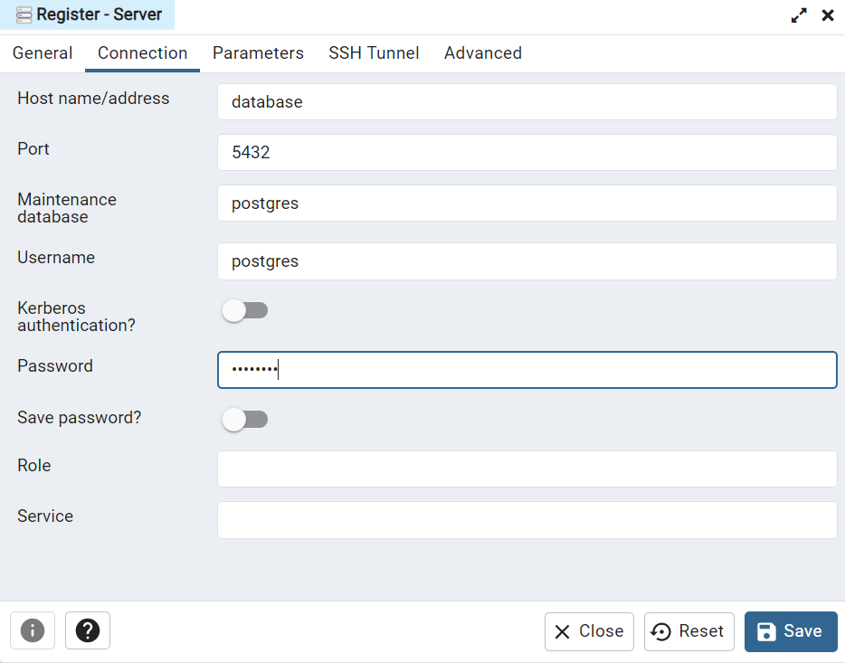

Для запуска компоузника в директории CarsharingWebsite ввести комманду docker compose up
Можно переходить на swagger
Для подключения к бд, нужно перейти по порту контейнера pgAdmin, и там создать новый сервер(в поле хоста ввести название контейнера с бд)

